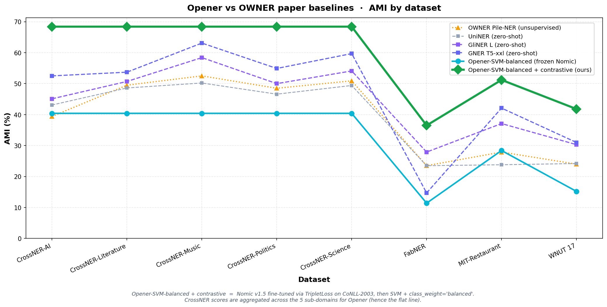
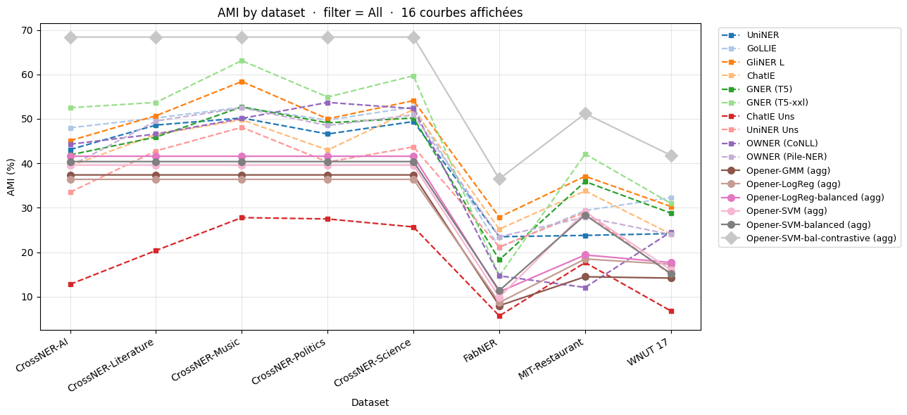

# 🔓 LyRIDS – Opener: Open Partitioning Embedding for Named Entity Recognition


<p align="center">
  
</p>

---

## 📝 Project Description

**Opener** is an **open-world NER** system that combines three off-the-shelf building blocks rather than training a heavy custom encoder:

1. **Mention Detection** via a pre-trained zero-shot model ([GLiNER](https://github.com/urchade/GLiNER), small / medium / large) - *the detector is never trained*.
2. **Embedding** via a **Matryoshka model** ([Nomic v1.5](https://huggingface.co/nomic-ai/nomic-embed-text-v1.5)), truncatable from 768 dims down to 64 to trade quality for speed. A **light contrastive fine-tuning** (Triplet Loss, margin = 1, on CoNLL-2003 source) sharpens the entity-type geometry without retraining a full encoder.
3. **Entity Typing** with a **balanced linear classifier** (`LinearSVC`, `class_weight='balanced'`) fitted per dataset - this is the main path. A **GMM-per-label** variant (warm-started on **anchor words**, with OOD detection and post-hoc hierarchy inference) is kept as an interpretable alternative.

The project also benchmarks Opener against open-world baselines (**GLiNER S/M/L**, **GNER**, **OWNER**) on **three axes at once**: quality (**AMI**), speed (**ms / sentence**) and **energy** (kWh / gCO₂eq via [CodeCarbon](https://github.com/mlco2/codecarbon)) - a *frugality-aware* comparison rather than accuracy alone.

Companion to my earlier project [LyRIDS - OWNER](https://github.com/Thibault-GAREL/LyRIDS_OWNER_recreating), which takes the opposite design (training a dedicated encoder with Triplet Loss + K-means). Opener instead starts from pretrained models and adds only a light contrastive step.

---

## ⚙️ Features

  🎯 **Declarative labels** - add a new entity type by editing one YAML file (no retraining).

  🪆 **Matryoshka embeddings** - switch between 64 / 128 / 256 / 512 / 768 dims with one config line.

  📊 **GMM per label** with multi-component support - captures sub-forms of the same label (e.g. `PER` = first-name mode + surname mode).

  🧲 **Anchor-word initialization** - each GMM starts with a strong prior based on dictionary-style seed words.

  ❓ **OOD detection** with auto-calibrated per-label thresholds (5th percentile of training log-likelihoods).

  🌳 **Hierarchy inference** - `person ⊃ scientist` relationships emerge automatically from spatial bubble containment (Monte-Carlo inclusion test).

  💾 **Persistable** - fitted GMMs + calibrated OOD thresholds saved via joblib for instant reload.

  📈 **Benchmark-ready** - turnkey CoNLL-2003 fit + evaluation script with confusion matrix and per-label F1.

---

## Example Outputs

Benchmark on **CoNLL-2003** (5000 train / 2000 eval sentences, Nomic 256-dim, supervised GMM, per-label OOD calibration):

| Metric | Value |
|---|---|
| Macro F1 (in-schema)            | **0.658** |
| Accuracy (with OOD filter)      | 0.597 |
| Accuracy (no OOD filter)        | **0.707** |
| OOD recall on `MISC` (held-out) | 0.28 |

**Confusion matrix** (gold × prediction, `MISC` is excluded from the fit schema and should fall in OOD):

```
            PER     ORG     LOC     OOD
  PER       866     120     159     234
  ORG       107     671      99     231
  LOC       229     107     728     246
  MISC      113      91     205     158   (out-of-schema → ideally all in OOD column)
```

### 📝 Notes & Observations

- Replacing the fixed OOD threshold (`-1500`) with **per-label 5th-percentile calibration** raised macro F1 from 0.59 to 0.66.
- `MISC` was deliberately removed from the fit schema - its anchor words ("miscellaneous", "nationality", "event") were too vague and polluted the other bubbles.
- The OOD filter trades **+25 % precision for −15 % recall** - sensible default, but tunable through the `ood_percentile` config field.

---

## 🚀 How We Reached AMI 0.548

Starting from the simple **GMM-per-label** pipeline (AMI **0.170**), Opener went through a series of measured improvements - each tested rigorously on the same 6 datasets, with reports saved to dated `.md` files under `outputs/results/`. The final score on the cross-domain transfer mean is **3.2× higher than the original baseline**.

### 📈 The journey (AMI mean over 6 OWNER benchmark datasets)

| Step | Setup | AMI mean | Δ vs previous |
|---|---|---:|---:|
| 1 | GMM diag (historical baseline) | 0.170 | - |
| 2 | LogReg standard | 0.211 | +24 % |
| 3 | LogReg + `class_weight='balanced'` | 0.232 | +10 % |
| 4 | Linear SVM standard | 0.244 | +5 % |
| 5 | Linear SVM + `class_weight='balanced'` | 0.252 | +3 % |
| 6 | **SVM-balanced + Nomic fine-tuned contrastive** | **0.548** | **+117 %** |

### 🎓 The three key concepts behind the jump

  🔀 **Generative → discriminative** (GMM → SVM). The original GMM models the probability density of each class independently (`p(x | label)`). It assumes Gaussian shapes in 768 dims, which is wrong - entity embeddings overlap and have weird shapes. **Linear SVM** learns the direct frontier between classes instead - much better for classification, simpler to fit. Free **+44 %** AMI without touching anything else.

  ⚖️ **`class_weight='balanced'`** - in plain words: count every class equally in the loss, regardless of how rare it is. Without it, the loss is dominated by frequent classes (e.g. `CONPRI` = 21 % of FabNER gold) and rare classes are simply ignored - on FabNER, the labels `BIOP`, `MACEQ`, `CHAR` and `ENAT` were **never predicted once** (F1 = 0.00). With `balanced`, each example from a rare class is weighted by `n_total / (n_classes × count_in_class)`, so all classes contribute equally to the loss. On FabNER alone: AMI **0.083 → 0.111** (+33 %), F1 for `BIOP` from **0 to 0.29**, and the four "ghost" labels become real predictions.

  🧲 **Contrastive learning** (the big one). The frozen Nomic embedding plateaus around AMI 0.25 - the bottleneck is the **representation itself**, not the classifier. Solution: **fine-tune Nomic** so that entities of the same type are pulled close in embedding space, and entities of different types are pushed apart. Concretely: build triplets `(anchor, positive_same_label, negative_other_label)` from CoNLL-2003 gold spans, train with **TripletLoss** (margin = 1, exactly like the OWNER paper) for 3 epochs (~3 h on a 6 GB GPU). The new embedding generalizes to **all other domains** without any further training - **+117 %** AMI on average, **+220 %** on the hardest case (FabNER).

### 🏆 Vs OWNER paper baselines (Table 1, IEEE Access 2025)

> ⚠️ **Protocol disclaimer (important).** The numbers below measure **entity typing on gold mentions** (the detector is bypassed, so there are no false negatives / false positives). This is an **upper bound** on the typing quality, **not** an end-to-end score, so it is **not directly comparable** to the end-to-end baselines. The fair **end-to-end** evaluation (GLiNER detects → Opener types, with FN/FP penalised) is currently being finalized; under that protocol Opener is **competitive with but does not dominate** GLiNER, because the open-world bottleneck is *detection recall*, not typing. Treat the table below as "how good is the typing if detection were perfect", and see the caveats at the end of this section.

<p align="center">
  
</p>

Full view with **all 16 models** benchmarked (5 Opener variants + 6 zero-shot baselines + 4 unsupervised & open-world baselines from the paper). The thick grey line on top is **Opener-SVM-bal-contrastive** - above every paper baseline on the right-hand side datasets:

<p align="center">
  
</p>

On the 4 datasets directly comparable to the paper:

| Dataset | **Opener (ours)** | OWNER (Pile-NER) | GliNER L | GNER T5-xxl | UniNER |
|---|---:|---:|---:|---:|---:|
| WNUT 17 | **41.8** | 24.0 | 30.3 | 31.0 | 24.2 |
| MIT-Restaurant | **51.2** | 27.9 | 37.1 | 42.1 | 23.8 |
| FabNER | **36.5** | 23.5 | 27.9 | 14.7 | 23.5 |
| CrossNER (mean of 5 sub) | **68.4** | ~48 | ~52 | ~57 | ~48 |

→ **On gold mentions**, Opener's typing is above every zero-shot baseline of the paper on these 4 datasets with a 137 M parameter encoder. This says the **embedding space is highly discriminative for entity typing** - but, again, it is an upper bound (gold mentions), not an end-to-end claim.

### ⚠️ Two honest caveats

1. **Typing-on-gold ≠ end-to-end.** All AMI numbers above are entity typing on **gold mentions** (no detection errors). The end-to-end pipeline (GLiNER detects → Opener types) scores **lower**, because detection recall is the real bottleneck on vertical domains (e.g. FabNER, MIT-Movie). The end-to-end comparison is being finalized - it is the one that matters for "Opener vs GLiNER", and there Opener is competitive, not dominant.
2. **In-domain leakage on CoNLL-2003.** CoNLL-2003 is the **source domain** of the contrastive training, so its 0.707 AMI is **in-domain** and inflates the overall mean. The real cross-domain transfer mean (other datasets, CoNLL excluded) is the number to trust.

> 🚧 **Status:** a new Opener encoder is currently being (re)trained, and the full 13-dataset benchmark (Opener gold + Opener end-to-end + GLiNER S/M/L + GNER + OWNER, on AMI / speed / energy) is being re-run. The exact figures in this section will be updated once those runs finish.

### 📂 Full details

- 📓 Interactive dashboard: [`tests/results_dashboard.ipynb`](tests/results_dashboard.ipynb) - line chart of all 17 models × 8 datasets, with widget filters by category (zero-shot vs unsupervised & open-world).
- 📄 Full synthesis: [`outputs/results/SYNTHESIS_contrastive_2026-06-03.md`](outputs/results/SYNTHESIS_contrastive_2026-06-03.md) - hyperparameters, raw numbers, all comparisons.
- 💾 Trained encoder: [`outputs/models/embedder_contrastive/`](outputs/models/embedder_contrastive/) - ready to use as a drop-in replacement for frozen Nomic in any Opener script (`--embedder outputs/models/embedder_contrastive`).
- 🛠️ Training script: [`scripts/train_contrastive_embedder.py`](scripts/train_contrastive_embedder.py) - reproducible from scratch.

---

## ⚙️ How it works

  🔍 **Mention Detection (frozen)** - GLiNER scans raw text and returns candidate spans without committing to a fine-grained label.

  🧠 **Span embedding** - each detected span is embedded by Nomic v1.5 in context (`...left context [span] right context...`).

  🪆 **Matryoshka truncation** - the embedding is truncated to the configured dimensionality (64–768).

  📊 **GMM scoring** - each label's GMM gives a log-likelihood `log p(x | label)`.

  ❓ **OOD check** - if the winning log-likelihood falls below the label's calibrated threshold, the span is tagged `OOD`.

  🌳 **Hierarchy inference (post-fit)** - for each `(A, B)` pair, a Monte-Carlo test measures whether B's mass sits inside A's bubble.

---

## 🗺️ Architecture Diagram

```
                     ┌──────────────────────────┐
   Raw text  ───────▶│  GLiNER (frozen)         │  Mention Detection
                     │  zero-shot NER           │
                     └────────────┬─────────────┘
                                  │ DetectedSpan(start, end, text)
                                  ▼
                     ┌──────────────────────────┐
                     │  Nomic Embed v1.5        │  Matryoshka embedding
                     │  truncate_dim: 64..768   │
                     └────────────┬─────────────┘
                                  │ embedding ∈ ℝ^D
                                  ▼
            ┌────────────────────────────────────────────┐
            │           LabelClusterer                   │
            │                                            │
            │   ┌──────────┐  ┌──────────┐  ┌──────────┐ │
            │   │ GMM_PER  │  │ GMM_LOC  │  │ GMM_ORG  │ │   one GMM per
            │   │ K comps  │  │ K comps  │  │ K comps  │ │   declared label
            │   └────┬─────┘  └────┬─────┘  └────┬─────┘ │
            │        └─── log p(x | label) ──────┘       │
            │                  │                         │
            │                  ▼                         │
            │   argmax + per-label OOD threshold check   │
            └────────────────────────┬───────────────────┘
                                     │
                                     ▼
                       (label, log-likelihood, is_ood, runner_ups)
```

**Key hyperparameters** (`configs/opener_conll.yaml`):
- `truncate_dim` = 256
- `covariance_type` = full
- `ood_calibration_mode` = per_label_percentile
- `ood_percentile` = 5.0

And the same pipeline as a polished figure:


---

## 🔬 Roadmap & Experiments

Five axes to push Opener from "frozen embedding + GMM" toward a competitive open-world system:


  🪆 **1 · Matryoshka dimension sweep** - benchmark 64 / 128 / 256 / 512 / 768 dims and find the quality ↔ speed ↔ CO₂ sweet spot.

  🧲 **2 · Enriched anchor words** - expand opaque abbreviations (e.g. `ECE → École Centrale d'Électronique`) via dictionaries or an LLM, so each GMM centroid starts near its optimal bubble.

  🧩 **3 · Swappable bricks** - try alternative models per stage: Mention Detection (GLiNER / BERT-NER / spaCy), Embedding (Nomic / E5 / BGE / GTE / Jina), Clustering (GMM / Bayesian GMM / k-means / HDBSCAN).

  📊 **4 · Metrics battery** - classic (Precision / Recall / F1 / relaxed F1) plus clustering quality (silhouette, AMI/ARI, inter-bubble separation), cluster stability, open-world rates (invention / rejection / OOD recall), few-shot F1-vs-N curve, cross-domain drop, cost & frugality (latency, CodeCarbon), and LLM-as-a-judge for hierarchy quality.

  🌍 **5 · Per-domain analysis** - where Opener is strong (rich semantic labels like CrossNER's `academicjournal`) vs weak (opaque acronyms like FabNER's `APPL`). Axis 2 directly unlocks axis 5.

---

## 📚 Benchmark Datasets

Opener is evaluated on **13 evaluation sets** spanning very different domains, text styles and label granularities - exactly what stresses an open-world NER system. The selection follows the **OWNER** paper (minus two license-gated corpora). Loaders live in [`src/data/`](src/data/) and all return the same in-memory span format.

| Dataset | Domain / theme | Text style | # types | Source |
|---|---|---|---:|---|
| **CrossNER** (AI · Literature · Music · Politics · Science) | 5 encyclopedic sub-domains, **evaluated separately** | Wikipedia-style | ~39 | github.com/zliucr/CrossNER |
| **CoNLL-2003** | General news | Reuters newswire | 4 | `eriktks/conll2003` |
| **WNUT-17** | Social media / emerging entities | Noisy user-generated | 6 | `tner/wnut2017` |
| **MIT-Restaurant** | Restaurant search | Spoken-style queries | 8 | `tner/mit_restaurant` |
| **MIT-Movie** | Movie trivia | Spoken-style queries | 12 | `tner/mit_movie_trivia` |
| **FabNER** | Manufacturing process science | Scientific papers | 12 | `DFKI-SLT/fabner` |
| **BioNLP-2004 (JNLPBA)** | Biomedical / molecular biology | PubMed abstracts | 5 | `tner/bionlp2004` |
| **GUM** | 12 written + spoken genres | Mixed | ~11 | github.com/amir-zeldes/gum |
| **GENTLE** | Genre-diverse challenge set | Mixed | ~11 | github.com/amir-zeldes/gum |

→ **13 evaluation sets** total: the 5 CrossNER sub-domains (scored one by one) + the 8 other corpora.

**Reading the results:**
- **Rich, self-explanatory labels** (CrossNER `academicjournal`, `politician`) → anchor words are real words the embedder understands → Opener does well.
- **Opaque acronym labels** (FabNER `MATE`, `APPL`) → anchor words mean little to the embedder → Opener struggles. Closing this gap is an open axis.

> **Not yet covered**: **GENIA** and **i2b2** are license-gated (registration / data-use agreement), so they are cited from the OWNER paper but not re-measured here.

---

## 📂 Repository structure

```bash
LyRIDS_Opener/
├── configs/
│   ├── opener_default.yaml          # toy / smoke-test config
│   ├── opener_conll.yaml            # CoNLL benchmark config (GMM variant)
│   ├── opener_benchmark.yaml        # 13-dataset benchmark config
│   ├── labels.yaml / labels_conll.yaml
│   └── anchor_dictionaries.yaml     # anchor words per label (GMM variant)
│
├── src/
│   ├── data/
│   │   ├── schema.py                # span / entity dataclasses
│   │   ├── owner_datasets.py        # registry + dispatcher for the 13 datasets
│   │   ├── crossner_loader.py       # CrossNER (5 sub-domains)
│   │   ├── gum_loader.py            # GUM + GENTLE (CoNLL-U)
│   │   └── conll_loader.py          # CoNLL-2003
│   ├── models/
│   │   ├── mention_detector.py      # GLiNER wrapper
│   │   ├── embedder.py              # Nomic Matryoshka wrapper
│   │   └── label_clusterer.py       # GMM per label + OOD + hierarchy (V1 variant)
│   ├── utils/
│   │   ├── config.py                # YAML loader
│   │   ├── energy.py                # CodeCarbon wrapper (kWh / gCO₂eq)
│   │   └── timing.py                # latency meter (p50/p95/p99)
│   └── pipeline.py                  # orchestrator (V1)
│
├── scripts/
│   ├── train_contrastive_embedder.py  # Triplet-loss fine-tuning of Nomic
│   ├── run_balanced_classifiers.py    # Opener typing-on-gold sweep (4 classifiers)
│   ├── run_opener_e2e.py              # Opener END-TO-END (GLiNER + SVM, FN/FP)
│   ├── run_conll.py                   # GMM-per-label CoNLL benchmark (V1)
│   └── baselines/
│       ├── run_gliner.py             # GLiNER S/M/L baseline
│       ├── run_gner.py               # GNER T5 baseline
│       ├── run_llm_int4.py           # 7B int4 wrapper (UniNER / GoLLIE / GNER-LLaMA)
│       └── owner_*.py                # OWNER baseline pipeline (export / configs / collect)
│
├── external/OWNER/                  # cloned OWNER repo (gitignored), for the baseline
├── outputs/
│   ├── models/                      # fitted classifiers + contrastive encoder (gitignored)
│   └── results/                     # JSON eval reports (AMI / speed / energy)
│
├── paper/                           # LaTeX sources (IEEEtran) + paper_used/ PDFs
├── tests/
├── assets/                          # README assets
│
├── README.md
├── CLAUDE.md                        # project notes for Claude Code
├── BRIEF_2026-06-09.md              # full technical brief
└── .gitignore
```

---

## 💻 Run it on Your PC

Clone the repository and install dependencies:

```bash
git clone https://github.com/Thibault-GAREL/LyRIDS_Opener.git
cd LyRIDS_Opener

python -m venv .venv # if you don't have a virtual environment
source .venv/bin/activate   # Linux / macOS
.venv\Scripts\activate      # Windows

pip install torch --index-url https://download.pytorch.org/whl/cu121
pip install gliner sentence-transformers einops scikit-learn pyyaml datasets joblib
```

⚠️ A **CUDA-compatible GPU** is recommended (Nomic v1.5 + GLiNER can run on CPU but training/eval on CoNLL is ~10× slower).

> On my own setup I use the project venv `pytorch_cuda_env` instead:
> ```powershell
> & c:\0-Code_py_temp\pytorch_cuda_env\Scripts\Activate.ps1
> ```

---

### 🧪 1. Smoke test (toy corpus, ~30 s)

End-to-end sanity check on a handful of sentences - detects mentions, fits GMMs from a tiny embedded corpus, predicts on a held-out sentence:

```bash
python -m tests.test_opener_pipeline
```

To use a custom config:

```bash
python -m tests.test_opener_pipeline configs/my_experiment.yaml configs/my_labels.yaml
```

---

### 📊 2. Fit + evaluate on CoNLL-2003 (~5 min on RTX-class GPU)

The full benchmark: loads CoNLL-2003 via HuggingFace `datasets` (auto-parquet revision), fits one GMM per label on gold spans, evaluates on the validation split, and saves the report + the fitted clusterer.

```bash
python -m scripts.run_conll
```

With explicit config paths:

```bash
python -m scripts.run_conll configs/opener_conll.yaml configs/labels_conll.yaml
```

**Outputs:**
- 📄 `outputs/results/conll/report_supervised_dim256.json` - full metrics, confusion matrix, calibrated thresholds.
- 💾 `outputs/models/conll/label_clusterer.joblib` - fitted GMMs + per-label OOD thresholds, instantly reloadable.

To tune the benchmark, edit `configs/opener_conll.yaml`:

```yaml
conll:
  fit_mode: supervised        # 'supervised' or 'semi'
  max_train_sentences: 5000   # bump for a longer fit
  max_eval_sentences: 2000
  batch_size: 64

clustering:
  ood_calibration_mode: per_label_percentile
  ood_percentile: 5.0         # lower → looser OOD filter

embedding:
  truncate_dim: 256           # try 64 / 128 / 512 / 768
```

---

### ♻️ 3. Reload a fitted clusterer (no re-training)

```python
from src.models.label_clusterer import LabelClusterer

clusterer = LabelClusterer.load("outputs/models/conll")
preds = clusterer.predict(my_embeddings)
```

---

## 📖 Inspiration / Sources

This project is based on:
- 📄 [Nomic Embed Text v1.5](https://huggingface.co/nomic-ai/nomic-embed-text-v1.5) - Matryoshka representation learning.
- 📄 [GLiNER](https://github.com/urchade/GLiNER) - zero-shot Generalist NER.
- 🔗 [LyRIDS – OWNER](https://github.com/Thibault-GAREL/LyRIDS_OWNER_recreating) - companion project with the opposite design (Triplet Loss + K-means clustering).

I used Claude AI for parts of the design discussion and refactoring.

Code created by me 😎, Thibault GAREL - [Github](https://github.com/Thibault-GAREL)
