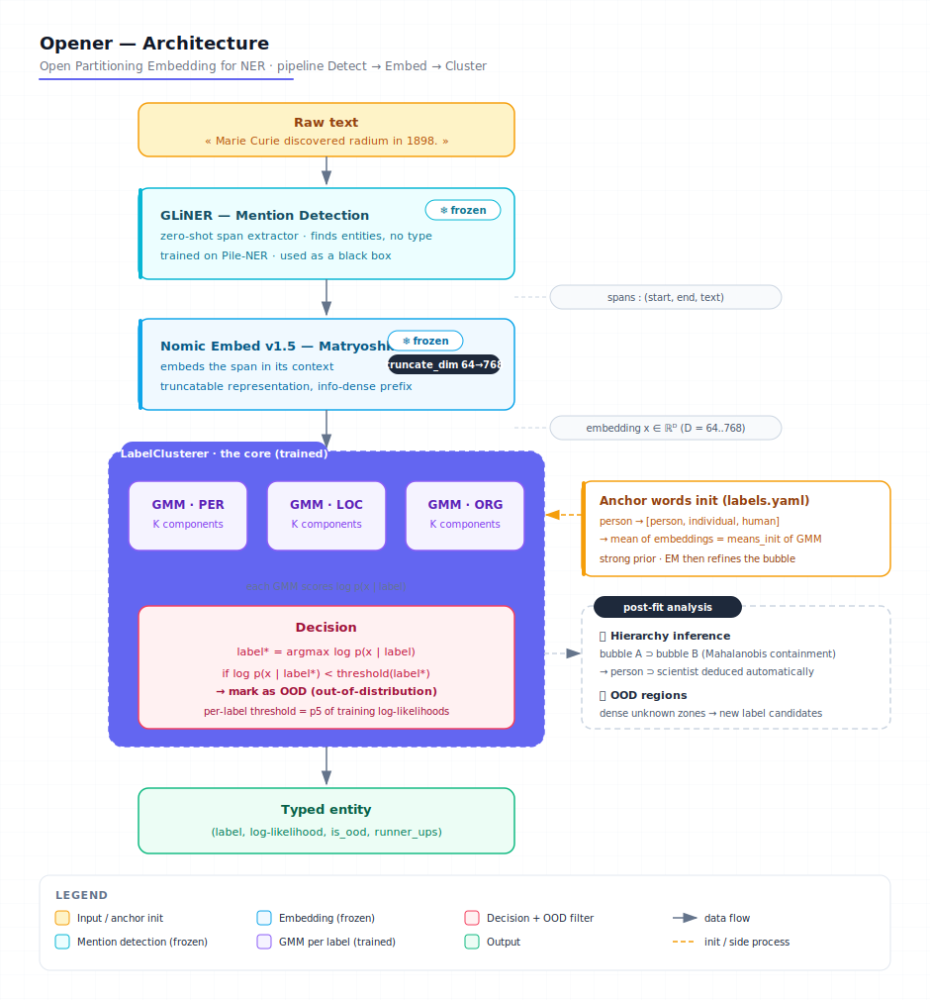
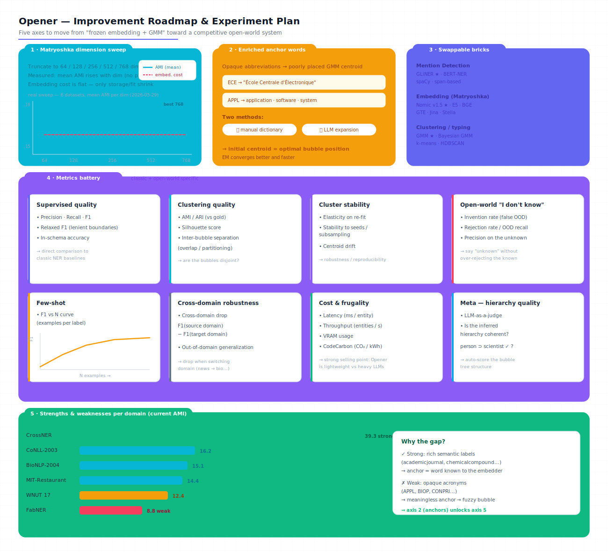

# 🔓 LyRIDS – Opener: Open Partitioning Embedding for Named Entity Recognition


<p align="center">
  
</p>

---

## 📝 Project Description

**Opener** is an **open-world NER** system that combines three off-the-shelf building blocks rather than training a custom encoder:

1. **Mention Detection** via a pre-trained zero-shot model ([GLiNER](https://github.com/urchade/GLiNER)) — *no training needed* for this stage.
2. **Embedding** via a **Matryoshka model** ([Nomic v1.5](https://huggingface.co/nomic-ai/nomic-embed-text-v1.5)) — truncatable from 768 → 64 dims to trade quality for speed.
3. **Entity Typing** with **one Gaussian Mixture Model per label**, initialized on the embedding of user-provided **anchor words** (e.g. centroid of `person` = embedding of `["person", "individual", "human"]`).

This setup lets you **declare new labels in a YAML file** instead of fine-tuning a model. Bubbles can overlap → a **hierarchy** (`person` ⊃ `scientist`) is inferred automatically from spatial inclusion. Entities far from every bubble are flagged **OOD** ("out-of-distribution") — useful to detect concepts the system doesn't yet know about.

Companion to my earlier project [LyRIDS – OWNER](https://github.com/Thibault-GAREL/LyRIDS_OWNER_recreating), but with a fundamentally different approach: **no Triplet Loss, no K-means, no embedding fine-tuning** — just clever use of pretrained models and statistical clustering.

---

## ⚙️ Features

  🎯 **Declarative labels** — add a new entity type by editing one YAML file (no retraining).

  🪆 **Matryoshka embeddings** — switch between 64 / 128 / 256 / 512 / 768 dims with one config line.

  📊 **GMM per label** with multi-component support — captures sub-forms of the same label (e.g. `PER` = first-name mode + surname mode).

  🧲 **Anchor-word initialization** — each GMM starts with a strong prior based on dictionary-style seed words.

  ❓ **OOD detection** with auto-calibrated per-label thresholds (5th percentile of training log-likelihoods).

  🌳 **Hierarchy inference** — `person ⊃ scientist` relationships emerge automatically from spatial bubble containment (Monte-Carlo inclusion test).

  💾 **Persistable** — fitted GMMs + calibrated OOD thresholds saved via joblib for instant reload.

  📈 **Benchmark-ready** — turnkey CoNLL-2003 fit + evaluation script with confusion matrix and per-label F1.

---

## Example Outputs

Benchmark on **CoNLL-2003** (5000 train / 2000 eval sentences, Nomic 256-dim, supervised GMM, per-label OOD calibration):

| Metric | Value |
|---|---|
| Macro F1 (in-schema)            | **0.658** |
| Accuracy (with OOD filter)      | 0.597 |
| Accuracy (no OOD filter)        | **0.707** |
| OOD recall on `MISC` (held-out) | 0.28 |

**Confusion matrix** (gold × prediction, `MISC` is excluded from the fit schema and should fall in OOD):

```
            PER     ORG     LOC     OOD
  PER       866     120     159     234
  ORG       107     671      99     231
  LOC       229     107     728     246
  MISC      113      91     205     158   (out-of-schema → ideally all in OOD column)
```

### 📝 Notes & Observations

- Replacing the fixed OOD threshold (`-1500`) with **per-label 5th-percentile calibration** raised macro F1 from 0.59 to 0.66.
- `MISC` was deliberately removed from the fit schema — its anchor words ("miscellaneous", "nationality", "event") were too vague and polluted the other bubbles.
- The OOD filter trades **+25 % precision for −15 % recall** — sensible default, but tunable through the `ood_percentile` config field.

---

## ⚙️ How it works

  🔍 **Mention Detection (frozen)** — GLiNER scans raw text and returns candidate spans without committing to a fine-grained label.

  🧠 **Span embedding** — each detected span is embedded by Nomic v1.5 in context (`...left context [span] right context...`).

  🪆 **Matryoshka truncation** — the embedding is truncated to the configured dimensionality (64–768).

  📊 **GMM scoring** — each label's GMM gives a log-likelihood `log p(x | label)`.

  ❓ **OOD check** — if the winning log-likelihood falls below the label's calibrated threshold, the span is tagged `OOD`.

  🌳 **Hierarchy inference (post-fit)** — for each `(A, B)` pair, a Monte-Carlo test measures whether B's mass sits inside A's bubble.

---

## 🗺️ Architecture Diagram

```
                     ┌──────────────────────────┐
   Raw text  ───────▶│  GLiNER (frozen)         │  Mention Detection
                     │  zero-shot NER           │
                     └────────────┬─────────────┘
                                  │ DetectedSpan(start, end, text)
                                  ▼
                     ┌──────────────────────────┐
                     │  Nomic Embed v1.5        │  Matryoshka embedding
                     │  truncate_dim: 64..768   │
                     └────────────┬─────────────┘
                                  │ embedding ∈ ℝ^D
                                  ▼
            ┌────────────────────────────────────────────┐
            │           LabelClusterer                   │
            │                                            │
            │   ┌──────────┐  ┌──────────┐  ┌──────────┐ │
            │   │ GMM_PER  │  │ GMM_LOC  │  │ GMM_ORG  │ │   one GMM per
            │   │ K comps  │  │ K comps  │  │ K comps  │ │   declared label
            │   └────┬─────┘  └────┬─────┘  └────┬─────┘ │
            │        └─── log p(x | label) ──────┘       │
            │                  │                         │
            │                  ▼                         │
            │   argmax + per-label OOD threshold check   │
            └────────────────────────┬───────────────────┘
                                     │
                                     ▼
                       (label, log-likelihood, is_ood, runner_ups)
```

**Key hyperparameters** (`configs/opener_conll.yaml`):
- `truncate_dim` = 256
- `covariance_type` = full
- `ood_calibration_mode` = per_label_percentile
- `ood_percentile` = 5.0

And the same pipeline as a polished figure:



---

## 🔬 Roadmap & Experiments

Five axes to push Opener from "frozen embedding + GMM" toward a competitive open-world system:



  🪆 **1 · Matryoshka dimension sweep** — benchmark 64 / 128 / 256 / 512 / 768 dims and find the quality ↔ speed ↔ CO₂ sweet spot.

  🧲 **2 · Enriched anchor words** — expand opaque abbreviations (e.g. `ECE → École Centrale d'Électronique`) via dictionaries or an LLM, so each GMM centroid starts near its optimal bubble.

  🧩 **3 · Swappable bricks** — try alternative models per stage: Mention Detection (GLiNER / BERT-NER / spaCy), Embedding (Nomic / E5 / BGE / GTE / Jina), Clustering (GMM / Bayesian GMM / k-means / HDBSCAN).

  📊 **4 · Metrics battery** — classic (Precision / Recall / F1 / relaxed F1) plus clustering quality (silhouette, AMI/ARI, inter-bubble separation), cluster stability, open-world rates (invention / rejection / OOD recall), few-shot F1-vs-N curve, cross-domain drop, cost & frugality (latency, CodeCarbon), and LLM-as-a-judge for hierarchy quality.

  🌍 **5 · Per-domain analysis** — where Opener is strong (rich semantic labels like CrossNER's `academicjournal`) vs weak (opaque acronyms like FabNER's `APPL`). Axis 2 directly unlocks axis 5.

---

## 📚 Benchmark Datasets

The benchmark ([`scripts/run_owner_benchmark.py`](scripts/run_owner_benchmark.py)) reu  ses the test sets from the **OWNER** paper. They span very different domains, text styles and label granularities — which is exactly what stresses an open-world NER system.

| Dataset | Domain / theme | Text style | Example entity types | # types | HF source |
|---|---|---|---|---:|---|
| **CrossNER** | Cross-domain: AI, literature, music, politics, science (merged) | Wikipedia-style encyclopedic | `academicjournal`, `chemicalcompound`, `musicalartist`, `politician`, `astronomicalobject` | 39 | `P3ps/Cross_ner` |
| **CoNLL-2003** | General news | Reuters newswire | `PER`, `ORG`, `LOC`, `MISC` | 4 | `eriktks/conll2003` |
| **BioNLP-2004** | Biomedical / molecular biology | PubMed abstracts | `protein`, `DNA`, `RNA`, `cell_type`, `cell_line` | 5 | `tner/bionlp2004` |
| **MIT-Restaurant** | Restaurant search | Spoken-style queries | `Cuisine`, `Dish`, `Amenity`, `Hours`, `Price`, `Rating`, `Location` | 8 | `tner/mit_restaurant` |
| **WNUT 17** | Social media / emerging entities | Noisy user-generated (tweets, forums) | `person`, `location`, `group`, `corporation`, `creative-work`, `product` | 6 | `wnut_17` |
| **FabNER** | Manufacturing process science | Scientific papers (manufacturing) | opaque acronyms: `MATE` (material), `MANP` (manuf. process), `MACEQ` (machine/equipment), `APPL`, `FEAT`, `PARA` … | 12 | `DFKI-SLT/fabner` |

**Reading the table:**
- **Rich, self-explanatory labels** (CrossNER) → anchor words are real dictionary words the embedder understands → Opener does well (AMI 39.3).
- **Opaque acronym labels** (FabNER) → anchor words are meaningless to the embedder → Opener struggles (AMI 8.8). This is the gap that **axis 2 (enriched anchor words)** is meant to close.

> **Not yet covered**: GENIA and i2b2 (license-gated), GENTLE and GUM (not on HF Hub as Parquet). CrossNER's five sub-domains are merged here (the `P3ps/Cross_ner` mirror does not carry the sub-domain split), so the score is not directly comparable to the paper's per-sub-domain figures.

---

## 📂 Repository structure

```bash
LyRIDS_Opener/
├── configs/
│   ├── opener_default.yaml          # toy / smoke-test config
│   ├── opener_conll.yaml            # CoNLL benchmark config
│   ├── labels.yaml                  # toy label list (person, scientist, ...)
│   └── labels_conll.yaml            # PER / ORG / LOC (MISC excluded on purpose)
│
├── src/
│   ├── data/
│   │   ├── schema.py                # DetectedSpan / TypedEntity / OpenerOutput
│   │   ├── serialization.py         # JSON load/save
│   │   └── conll_loader.py          # CoNLL-2003 BIO → Opener span format
│   ├── models/
│   │   ├── mention_detector.py      # GLiNER wrapper
│   │   ├── embedder.py              # Nomic Matryoshka wrapper
│   │   └── label_clusterer.py       # GMM per label + OOD + hierarchy
│   ├── utils/
│   │   └── config.py                # YAML loader
│   └── pipeline.py                  # orchestrator (init / fit / predict)
│
├── scripts/
│   └── run_conll.py                 # fit + eval on CoNLL-2003
│
├── tests/
│   └── test_opener_pipeline.py      # end-to-end smoke test
│
├── outputs/
│   ├── models/conll/                # fitted GMMs (joblib)
│   └── results/conll/               # JSON eval reports
│
├── assets/                             # README assets
│
├── README.md
├── CLAUDE.md                        # project notes for Claude Code
└── .gitignore
```

---

## 💻 Run it on Your PC

Clone the repository and install dependencies:

```bash
git clone https://github.com/Thibault-GAREL/LyRIDS_Opener.git
cd LyRIDS_Opener

python -m venv .venv # if you don't have a virtual environment
source .venv/bin/activate   # Linux / macOS
.venv\Scripts\activate      # Windows

pip install torch --index-url https://download.pytorch.org/whl/cu121
pip install gliner sentence-transformers einops scikit-learn pyyaml datasets joblib
```

⚠️ A **CUDA-compatible GPU** is recommended (Nomic v1.5 + GLiNER can run on CPU but training/eval on CoNLL is ~10× slower).

> On my own setup I use the project venv `pytorch_cuda_env` instead:
> ```powershell
> & c:\0-Code_py_temp\pytorch_cuda_env\Scripts\Activate.ps1
> ```

---

### 🧪 1. Smoke test (toy corpus, ~30 s)

End-to-end sanity check on a handful of sentences — detects mentions, fits GMMs from a tiny embedded corpus, predicts on a held-out sentence:

```bash
python -m tests.test_opener_pipeline
```

To use a custom config:

```bash
python -m tests.test_opener_pipeline configs/my_experiment.yaml configs/my_labels.yaml
```

---

### 📊 2. Fit + evaluate on CoNLL-2003 (~5 min on RTX-class GPU)

The full benchmark: loads CoNLL-2003 via HuggingFace `datasets` (auto-parquet revision), fits one GMM per label on gold spans, evaluates on the validation split, and saves the report + the fitted clusterer.

```bash
python -m scripts.run_conll
```

With explicit config paths:

```bash
python -m scripts.run_conll configs/opener_conll.yaml configs/labels_conll.yaml
```

**Outputs:**
- 📄 `outputs/results/conll/report_supervised_dim256.json` — full metrics, confusion matrix, calibrated thresholds.
- 💾 `outputs/models/conll/label_clusterer.joblib` — fitted GMMs + per-label OOD thresholds, instantly reloadable.

To tune the benchmark, edit `configs/opener_conll.yaml`:

```yaml
conll:
  fit_mode: supervised        # 'supervised' or 'semi'
  max_train_sentences: 5000   # bump for a longer fit
  max_eval_sentences: 2000
  batch_size: 64

clustering:
  ood_calibration_mode: per_label_percentile
  ood_percentile: 5.0         # lower → looser OOD filter

embedding:
  truncate_dim: 256           # try 64 / 128 / 512 / 768
```

---

### ♻️ 3. Reload a fitted clusterer (no re-training)

```python
from src.models.label_clusterer import LabelClusterer

clusterer = LabelClusterer.load("outputs/models/conll")
preds = clusterer.predict(my_embeddings)
```

---

## 📖 Inspiration / Sources

This project is based on:
- 📄 [Nomic Embed Text v1.5](https://huggingface.co/nomic-ai/nomic-embed-text-v1.5) — Matryoshka representation learning.
- 📄 [GLiNER](https://github.com/urchade/GLiNER) — zero-shot Generalist NER.
- 🔗 [LyRIDS – OWNER](https://github.com/Thibault-GAREL/LyRIDS_OWNER_recreating) — companion project with the opposite design (Triplet Loss + K-means clustering).

I used Claude AI for parts of the design discussion and refactoring.

Code created by me 😎, Thibault GAREL - [Github](https://github.com/Thibault-GAREL)
