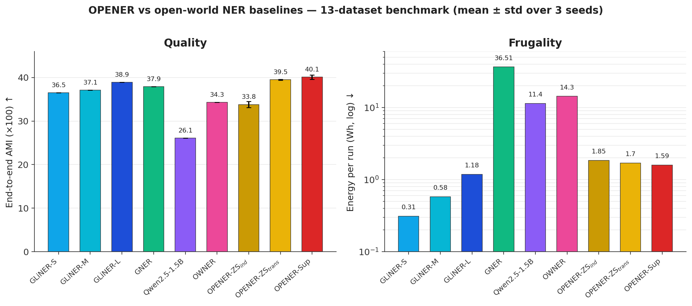

# 🔓 OPENER: Open Partitioning Embedding for Named Entity Recognition


[](https://huggingface.co/Thibault-GAREL/opener-zs)
[](https://huggingface.co/Thibault-GAREL/opener-sup)


<p align="center">
  
</p>

---

## 📝 Project Description

**OPENER** is an **open-world NER** system built entirely from off-the-shelf parts (a frozen detector, a fine-tuned embedder, a light typing head), so no encoder is trained from scratch.

1. **Mention Detection** via a frozen, never fine-tuned zero-shot model ([GLiNER-L](https://github.com/urchade/GLiNER)).
2. **Embedding** via a **Matryoshka model** ([Nomic Embed Text v1.5](https://huggingface.co/nomic-ai/nomic-embed-text-v1.5)), sharpened with **contrastive fine-tuning** (triplet loss) and **error-driven hard-negative mining**, so entities of the same type cluster together in embedding space and the space stays truncatable from 768 down to 64 dims.
3. **Entity Typing** with two interchangeable operating points on the same embedder: **OPENER-ZS** (zero-shot, label-name prototypes, no target labels needed) and **OPENER-Sup** (a tiny balanced `LinearSVC` fitted on your own labelled spans, the most accurate setting).

Both fine-tuned embedders are hosted on the Hugging Face Hub, ready for `from_pretrained()`: 🤗 [`Thibault-GAREL/opener-zs`](https://huggingface.co/Thibault-GAREL/opener-zs) and 🤗 [`Thibault-GAREL/opener-sup`](https://huggingface.co/Thibault-GAREL/opener-sup).

The method and a **13-dataset benchmark** (quality, latency and energy) are written up in full in the paper (submitted to *Knowledge-Based Systems*, Elsevier), linked in the Inspiration / Sources section below.

Companion to my earlier project [LyRIDS OWNER](https://github.com/Thibault-GAREL/LyRIDS_OWNER_recreating), which takes the opposite design (training a dedicated encoder with Triplet Loss and K-means clustering). OPENER instead starts from pretrained models and only adds a light contrastive step on top.

---

## ⚙️ Features

  🎯 **Two turnkey operating points** on the same embedder, OPENER-ZS (zero-shot, no training) and OPENER-Sup (fit a tiny linear head on your own labels).

  🪆 **Matryoshka embeddings** truncatable from 768 down to 64 dims with one config line, up to 7x cheaper to fit for a small AMI drop.

  🧲 **Contrastive fine-tuning plus hard-negative mining**: triplet loss on CoNLL-2003 spans, then a second pass mined on the entity pairs the model confuses most (e.g. `writer` / `person`, `album` / `band`).

  🤗 **Hugging Face hosted embedders**, pulled with `from_pretrained()`, GLiNER auto-downloaded on first use.

  ⚖️ **Balanced typing head** (`class_weight='balanced'` `LinearSVC`), so rare labels are not silently ignored.

  🌍 **Transductive refinement plus detector fusion** for OPENER-ZS: prototypes are refined on the unlabelled test mentions and blended with the detector's own zero-shot guess, no target labels required.

  📊 **13-dataset benchmark** against GLiNER S/M/L, GNER, Qwen2.5-1.5B and OWNER, on three axes at once, AMI, latency (p50/p95/p99) and energy (CodeCarbon).

  📄 **Published research**: full method and benchmark write-up submitted to *Knowledge-Based Systems* (Elsevier).

---

## Example Outputs

<p align="center">
  
</p>

Final 13-dataset benchmark, end-to-end AMI (mean ± std over 3 embedder-retraining seeds):

| System | Params | AMI ↑ | Latency (ms) ↓ | Energy (Wh) ↓ |
|---|---:|---:|---:|---:|
| GLiNER-L | 330M | 38.9 | 143 | 1.18 |
| GNER | 220M | 37.9 | 4226 | 36.51 |
| OWNER | 294M | 34.3 | 616 | 14.3 |
| OPENER-ZS (fused) | 467M | **39.5 ± 0.1** | 182 | 1.70 |
| **OPENER-Sup** | 467M | **40.1 ± 0.5** | 143 | 1.59 |

A minimal usage example (OPENER-ZS, no training needed):

```python
from opener import OpenerZS

m = OpenerZS.from_pretrained("Thibault-GAREL/opener-zs")   # + auto-downloads GLiNER-L
ents = m.predict(
    "Marie Curie discovered radium at the University of Paris.",
    labels=["person", "discovery", "organization", "location"],
)
# [{'start': 0, 'end': 11, 'text': 'Marie Curie', 'label': 'person', 'score': 0.97}, ...]
```

### 📝 Notes & Observations

- OPENER-Sup is the most accurate operating point (62.3 AMI on gold mentions), OPENER-ZS is the frugal, annotation-free one, and both share the exact same fine-tuned embedder.
- Detection, not typing, is the open-world bottleneck: typing on gold mentions reaches 62.3 AMI, but end-to-end quality is capped by the detector's recall on cryptic, domain-specific spans (FabNER, MIT-Movie).
- OPENER stays one to two orders of magnitude cheaper in energy than GNER, Qwen2.5-1.5B and OWNER, at comparable or better quality.

---

## ⚙️ How it works

  🔍 **Mention Detection (frozen)**. GLiNER-L scans raw text and returns candidate spans, without any fine-tuning.

  🧠 **Span embedding in context**. Each span is embedded by the fine-tuned Nomic v1.5 Matryoshka model, together with its surrounding context.

  🪆 **Matryoshka truncation**. The embedding is truncated to the configured dimensionality (64 to 768), trading a little quality for a much cheaper fit.

  🧲 **Contrastive geometry**. Triplet loss, then hard-negative mining, pull same-type entities together and push different types apart, so the space becomes linearly separable.

  🎯 **Typing head**. Either a balanced `LinearSVC` fitted on your labels (OPENER-Sup), or nearest label-name prototypes, transductively refined and fused with the detector's own guess (OPENER-ZS).

---

## 🗺️ Architecture Diagram

<p align="center">
  
</p>

**Key hyperparameters** (see the paper for the full ablation):
- Contrastive stage: triplet margin 1, CoNLL-2003 train spans, 3 epochs.
- Hard-negative mining: 8000 triplets, 65% hard, 3 epochs.
- Matryoshka `truncate_dim`: 768 by default, sweepable down to 64.
- Typing: `LinearSVC(class_weight='balanced')` for OPENER-Sup, label-name prototypes plus transductive refinement plus detector fusion for OPENER-ZS.

And the effect of the contrastive stages on a held-out domain (WNUT-17, never seen during training), visualised with UMAP:

<p align="center">
  
</p>

---

## 📚 Benchmark Datasets

OPENER is evaluated on **13 evaluation sets** spanning very different domains, text styles and label granularities, exactly what stresses an open-world NER system. The selection follows the **OWNER** paper (minus two license-gated corpora). Loaders live in [`src/data/`](src/data/) and all return the same in-memory span format.

| Dataset | Domain / theme | # types | Source |
|---|---|---:|---|
| **CrossNER** (AI · Literature · Music · Politics · Science) | 5 encyclopedic sub-domains, evaluated separately | ~39 | [github.com/zliucr/CrossNER](https://github.com/zliucr/CrossNER) |
| **CoNLL-2003** | General news | 4 | 🤗 [`eriktks/conll2003`](https://huggingface.co/datasets/eriktks/conll2003) |
| **WNUT-17** | Social media / emerging entities | 6 | 🤗 [`wnut_17`](https://huggingface.co/datasets/wnut_17) |
| **MIT-Restaurant** | Restaurant search, spoken-style queries | 8 | 🤗 [`tner/mit_restaurant`](https://huggingface.co/datasets/tner/mit_restaurant) |
| **MIT-Movie** | Movie trivia, spoken-style queries | 12 | 🤗 [`tner/mit_movie_trivia`](https://huggingface.co/datasets/tner/mit_movie_trivia) |
| **FabNER** | Manufacturing process science | 12 | 🤗 [`DFKI-SLT/fabner`](https://huggingface.co/datasets/DFKI-SLT/fabner) |
| **BioNLP-2004** (JNLPBA) | Biomedical, PubMed abstracts | 5 | 🤗 [`tner/bionlp2004`](https://huggingface.co/datasets/tner/bionlp2004) |
| **GUM** | 12 written and spoken genres | ~11 | [github.com/amir-zeldes/gum](https://github.com/amir-zeldes/gum) |
| **GENTLE** | Genre-diverse out-of-domain challenge set | ~11 | same repo as GUM |

**Not on Hugging Face**: the 5 CrossNER sub-domains, GUM and GENTLE are downloaded straight from their GitHub repos ([`src/data/crossner_loader.py`](src/data/crossner_loader.py), [`src/data/gum_loader.py`](src/data/gum_loader.py)), they are not distributed as HF `datasets`.

**Not covered**: **GENIA** and **i2b2** are license-gated (registration / data-use agreement), so they are cited from the OWNER paper but not re-measured here.

**Bonus, outside the 13 evaluation sets**: 🤗 [`Universal-NER/Pile-NER-type`](https://huggingface.co/datasets/Universal-NER/Pile-NER-type) is used to train and ablate an alternative, fully domain-agnostic zero-shot embedder ([`scripts/train_contrastive_pilener.py`](scripts/train_contrastive_pilener.py)).

---

## 📄 Full Paper

<details>
<summary>📄 Click to expand all 20 pages (IEEE, LyRIDS Symposium 2026)</summary>

<p align="center">
  
</p>

<p align="center">
  
</p>

<p align="center">
  
</p>

<p align="center">
  
</p>

<p align="center">
  
</p>

<p align="center">
  
</p>

<p align="center">
  
</p>

<p align="center">
  
</p>

<p align="center">
  
</p>

<p align="center">
  
</p>

<p align="center">
  
</p>

<p align="center">
  
</p>

<p align="center">
  
</p>

<p align="center">
  
</p>

<p align="center">
  
</p>

<p align="center">
  
</p>

<p align="center">
  
</p>

<p align="center">
  
</p>

<p align="center">
  
</p>

<p align="center">
  
</p>

</details>

Full PDF (text-selectable): [`OPENER IEEE with authors - LyRIDS Symposium 2026.pdf`](paper/OPENER%20IEEE%20with%20authors%20-%20LyRIDS%20Symposium%202026.pdf)

---

## 📂 Repository structure

```bash
LyRIDS_Opener/
├── opener-ner/                      # pip-installable package (turnkey OPENER-ZS / OPENER-Sup)
│   ├── opener/                      # OpenerZS, OpenerSup, shared HF loading logic
│   └── cards/                       # Hugging Face model cards (opener-zs, opener-sup)
│
├── KBS_paper/                       # journal submission (Knowledge-Based Systems, Elsevier)
├── paper/                           # internal LyRIDS Symposium write-up (same method)
│
├── configs/
│   ├── opener_default.yaml          # toy / smoke-test config
│   ├── opener_conll.yaml            # CoNLL benchmark config (GMM variant)
│   ├── opener_benchmark.yaml        # 13-dataset benchmark config
│   ├── labels.yaml / labels_conll.yaml
│   └── anchor_dictionaries.yaml     # anchor words per label (GMM variant)
│
├── src/
│   ├── data/
│   │   ├── schema.py                # span / entity dataclasses
│   │   ├── owner_datasets.py        # registry + dispatcher for the 13 datasets
│   │   ├── crossner_loader.py       # CrossNER (5 sub-domains, from GitHub)
│   │   ├── gum_loader.py            # GUM + GENTLE (CoNLL-U, from GitHub)
│   │   └── conll_loader.py          # CoNLL-2003 (from Hugging Face)
│   ├── models/
│   │   ├── mention_detector.py      # GLiNER wrapper
│   │   ├── embedder.py              # Nomic Matryoshka wrapper
│   │   └── label_clusterer.py       # GMM per label + OOD + hierarchy (V1 variant)
│   ├── utils/
│   │   ├── config.py                # YAML loader
│   │   ├── energy.py                # CodeCarbon wrapper (kWh / gCO2eq)
│   │   └── timing.py                # latency meter (p50/p95/p99)
│   └── pipeline.py                  # orchestrator (V1)
│
├── scripts/
│   ├── train_contrastive_embedder.py  # triplet-loss fine-tuning of Nomic
│   ├── train_contrastive_pilener.py   # domain-agnostic variant (Pile-NER)
│   ├── run_balanced_classifiers.py    # OPENER-Sup typing-on-gold sweep
│   ├── run_opener_e2e.py              # OPENER-Sup end-to-end (GLiNER + SVM)
│   ├── run_opener_zs_e2e_fusion.py    # OPENER-ZS end-to-end (prototypes + fusion)
│   ├── run_multiseed.sh               # full 3-seed retraining and re-evaluation
│   ├── aggregate_multiseed.py         # aggregates the 3 seeds into mean ± std
│   ├── make_umap.py                   # UMAP figure of the contrastive stages
│   └── baselines/                     # GLiNER / GNER / Qwen int4 / OWNER baselines
│
├── external/OWNER/                  # cloned OWNER repo (gitignored), for the baseline
├── outputs/
│   ├── models/                      # fitted classifiers + contrastive encoder (gitignored)
│   └── results/                     # JSON eval reports (AMI / speed / energy)
│
├── tests/
├── assets/                          # README assets
│
├── README.md
├── LICENSE
└── .gitignore
```

---

## 💻 Run it on Your PC

### 🤗 Quick start (turnkey pipeline)

Clone the repository and install the `opener-ner` package from source (the model weights are pulled from the Hugging Face Hub at runtime, no local checkpoint needed):

```bash
git clone https://github.com/Thibault-GAREL/LyRIDS_Opener.git
cd LyRIDS_Opener

python -m venv .venv # if you don't have a virtual environment
source .venv/bin/activate   # Linux / macOS
.venv\Scripts\activate      # Windows

pip install -e ./opener-ner
```

```python
from opener import OpenerZS

m = OpenerZS.from_pretrained("Thibault-GAREL/opener-zs")
ents = m.predict("Marie Curie discovered radium.", labels=["person", "element"])
```

⚠️ A **CUDA-compatible GPU** is recommended (Nomic v1.5 and GLiNER run on CPU too, but noticeably slower).

> A standalone `pip install opener-ner` release on PyPI is planned, the package is not published there yet, install from the cloned source in the meantime.

---

### 🔬 Full research setup (reproduce the benchmark)

```bash
pip install torch --index-url https://download.pytorch.org/whl/cu121
pip install gliner sentence-transformers einops scikit-learn pyyaml datasets joblib codecarbon
```

> On my own setup I use the project venv `pytorch_cuda_env` instead:
> ```powershell
> & c:\0-Code_py_temp\pytorch_cuda_env\Scripts\Activate.ps1
> ```

**1. Smoke test** (toy corpus, ~30 s), detects mentions, fits a tiny clusterer, predicts on a held-out sentence:

```bash
python -m tests.test_opener_pipeline
```

**2. Fine-tune the embedder** (contrastive stage, then hard-negative mining):

```bash
python -m scripts.train_contrastive_embedder
```

**3. Run the end-to-end benchmark** on a dataset (GLiNER detects, OPENER types):

```bash
python -m scripts.run_opener_e2e --datasets crossner_ai        # OPENER-Sup
python -m scripts.run_opener_zs_e2e_fusion --datasets crossner_ai   # OPENER-ZS
```

**4. Full multi-seed reproduction** (3 embedder retrainings, 13 datasets each, several hours on a 6 GB GPU):

```bash
bash scripts/run_multiseed.sh
python -m scripts.aggregate_multiseed
```

---

## 📖 Inspiration / Sources

This project is based on:
- 📄 [Nomic Embed Text v1.5](https://huggingface.co/nomic-ai/nomic-embed-text-v1.5), Matryoshka representation learning.
- 📄 [GLiNER](https://github.com/urchade/GLiNER), zero-shot Generalist NER.
- 🔗 [LyRIDS OWNER](https://github.com/Thibault-GAREL/LyRIDS_OWNER_recreating), companion project with the opposite design (Triplet Loss and K-means clustering).

Full method and benchmark: paper PDF [`OPENER - KBS paper.pdf`](KBS_paper/OPENER%20-%20KBS%20paper.pdf) (submitted to *Knowledge-Based Systems*, Elsevier).

Fine-tuned models on the Hugging Face Hub: 🤗 [`opener-zs`](https://huggingface.co/Thibault-GAREL/opener-zs) (zero-shot) and 🤗 [`opener-sup`](https://huggingface.co/Thibault-GAREL/opener-sup) (supervised).

Code created by me 😎, Thibault GAREL - [Github](https://github.com/Thibault-GAREL)
